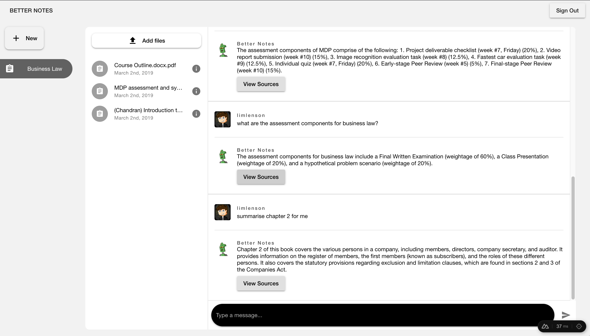

 

  
  <h3 align="center">BetterNotes</h3>
  
  

    Transforming the way we interact with information!
     
    <a href="https://www.youtube.com/watch?v=ALFtZPulHMM&ab_channel=LensonLim"><strong>View Demo »</strong></a>
     
     
    <a href="https://github.com/Lebarnon/BetterNotesServer">Server Repo</a>
    ·
    <a href="https://github.com/Lebarnon/BetterNotesApp/issues">Report Bug</a>
    ·
    <a href="https://github.com/Lebarnon/BetterNotesApp/issues">Request Feature</a>
  

 

# About
BetterNotes is a Software as a Service (SaaS) application designed to transform the way we interact with information. With BetterNotes, you can effortlessly input new information into a personalized AI chatbot, creating a digital companion that adapts to your needs. Moreover, the platform allows you to organize your information into separate collections, streamlining your data management process. Think of it as your digital library where you can upload documents and "talk" to them.

# Technology Stack

**Frontend:**  
Nuxt.js + Typescript

**Backend:**  
- Databases: Firebase (Firestore, Storage) + Pinecone
- Serverless Compute Service: Firebase Function
- LLM Framework: LangChain
- LLM: OpenAI

### Layer 1: NuxtJS and the Three Firebase Services
Nuxt.js is a popular framework for building web applications, especially for creating server-rendered Vue.js applications. It's the Vue.js equivalent of Next.js for React. It builds upon Vue.js and provides several additional benefits and features that can streamline development and improve the performance of your web applications. Some of these benefits include:

- Server-Side Rendering (SSR)
- Automatic Routing
- Pre-fetching and Pre-rendering
- Layouts and Views
- Middleware
- Vue Router
- Async Data Fetching
- Plugin System
- Static Site Generation (SSG)

Typescript complements NuxtJS by providing:

- Type Safety
- Code Predictability
- Better Collaboration
- Enhanced Tooling

In my previous project [NTUStars](https://github.com/Lebarnon/NTUStars), I talked about how I should have used Typescript, and boy was I right. Programming in Typescript provided a much better development experience.

In this layer, the app interacts with three main backend services: **Firebase Authentication**, **Firebase Storage**, and **Firestore**.

Firebase Authentication provides auth state changes to Nuxt, which then reacts accordingly.

Firebase Storage allows users to upload files to the cloud.

Firestore, lastly, allows users to create Collections and Documents but only under their directory, ensuring security. Furthermore, Nuxt subscribes to certain collections and documents that listen for changes in them and update the frontend accordingly. The chat messages are great examples of this model.

### Layer 2: Firebase Function as a Background Worker
Firebase Functions are designed to run serverless, event-driven code in response to various types of triggers such as HTTP requests, database changes, and more. In our case, it responds to two main triggers:
1. Document Upload
Whenever a document gets uploaded to a cloud storage bucket by a user, a Firebase Function will be triggered by this upload and proceed to execute. The function's main job is to extract text from documents via **text extraction**, **Google's Document AI** (coming soon), and **OpenAI's Whisper Model** (coming soon).
The extracted text will then undergo **Layer 3: Case 1** to generate vector embeddings IDs.
Finally, the resulting text and vector embeddings IDs will be stored in the appropriate document in Firestore.

2. New Message Creation
When a user asks a question, a new document with the question is created under that particular user's document. This triggers a Firebase function that will execute Case 2 in **Layer 3: Case 2**.

### Layer 3: LLM Service Layer

**Case 1: Processing Document**  
After extracting content from documents, vector embeddings will be generated in batches using OpenAI's API through **LangChain**. The resulting vectors will then be stored in a **Pinecone** vector database along with other metadata for easy identification of the owner's identity and information like the source.

**Case 2: Generating Response**  
Generating a response from a query follows these steps:
1. Vector Embeddings of the query will be generated using OpenAI's API.
2. Vector Embeddings used to query the top k matches from the user's allocated segment in the Pinecone database.
3. The top k matches will be prepended to the actual question asked by the user, and a request will be sent to ChatGPT.
4. The response will be stored in the appropriate document in Firebase.
5. The user who should be subscribed to the document will receive the update, and the answer will be reflected on the frontend.

# Conclusion
Currently, I'm actively working on making this more robust before releasing it to the public. Hence, if BetterNotes resonates with you or you're interested in exploring potential collaborations, feel free to reach out!
